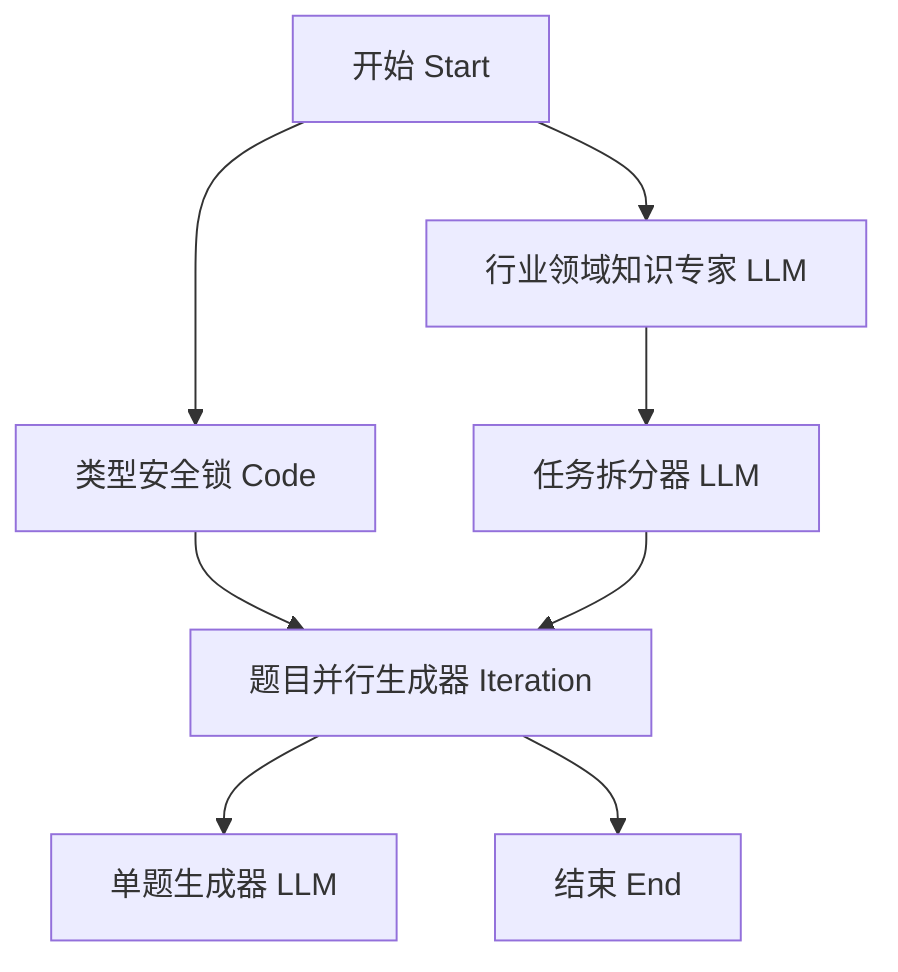

# Dify 智能题库生成系统 - DSL 架构重构方案 (LLM 替代版)

## 1. 方案背景
当前系统依赖 **Google Search** 和 **Firecrawl Scrape** 获取外部知识。虽然保证了内容的实时性，但在以下场景存在局限：
- **延迟高**：网络搜索和网页抓取涉及多次外部请求，累积耗时较长。
- **稳定性受限**：受网络环境、爬虫限制（如 Cloudflare）及 API 配额影响。
- **可控性弱**：返回的网页内容往往包含广告、导航等无关信息，增加大模型上下文压力。

本方案旨在采用 **"内生知识推理"** 模式，由高性能大模型直接生成知识背景，实现全链路 LLM 化。

---

## 2. 核心架构设计

### 2.1 工作流拓扑变更
新流程移除了搜索和爬虫节点，代之以“行业领域知识专家”节点。



### 2.2 节点详细定义

#### [NEW] 行业领域知识专家 (LLM Node)
- **ID**: `llm_knowledge_expert`
- **模型建议**: `deepseek-v3` 或 `deepseek-reasoner` (R1)
- **输入变量**: `{{#start.profession#}}`, `{{#start.topic#}}`
- **核心 Prompt**:
  ```text
  你是一位资深的专业教育专家和行业顾问。
  请针对【{{#start.profession#}}】领域中的【{{#start.topic#}}】知识点，生成一份详尽的内部培训参考大纲。
  大纲必须包含：
  1. 核心定义与关键概念。
  2. 行业标准操作流程（SOP）或最佳实践。
  3. 常见的实操误区与难点分析。
  4. 3-5个真实且具有代表性的业务场景案例。
  
  输出格式：严格使用 Markdown，分级清晰。
  ```

#### [UPDATE] 任务拆分器 (LLM Node)
- **变更点**: 将 `context` 来源由 `tool_firecrawl` 替换为 `llm_knowledge_expert`。
- **关联变量**: `{{#llm_knowledge_expert.text#}}`

#### [UPDATE] 单题生成器 (LLM Node)
- **变更点**: 同样将背景资料 `background` 指向 `llm_knowledge_expert`。

---

## 3. 方案优势分析

| 维度 | 原方案 (Search/Scrape) | 新方案 (LLM Replacement) |
| :--- | :--- | :--- |
| **执行速度** | 约 15-30s (受限网络) | 约 5-10s (模型直接输出) |
| **稳定性** | 中 (受爬虫和搜索配额限制) | 极高 (仅依赖大模型 API) |
| **成本** | 较高 (模型费 + 搜索/爬虫费) | 较低 (仅模型费) |
| **内容质量** | 原生素材，可能冗杂 | 结构化专家知识，更精准 |

---

## 4. 实施建议
1. **模型选择**：建议使用 `DeepSeek-V3` 负责背景知识生成，兼顾广度与逻辑性。若对专业深度要求极高（如医疗、法律），可切换至 `DeepSeek-R1`。
2. **知识对齐**：若用户输入的 `topic` 非常偏僻，建议在 Prompt 中加入“若不确定具体细节，请基于通用的专业原则进行逻辑推演”。
3. **DSL 替换**：在 Dify 中手动删除搜索/爬虫节点后，新增 LLM 节点并重新连接 Edge 即可。

---

**设计者**: Antigravity
**日期**: 2026-03-22
