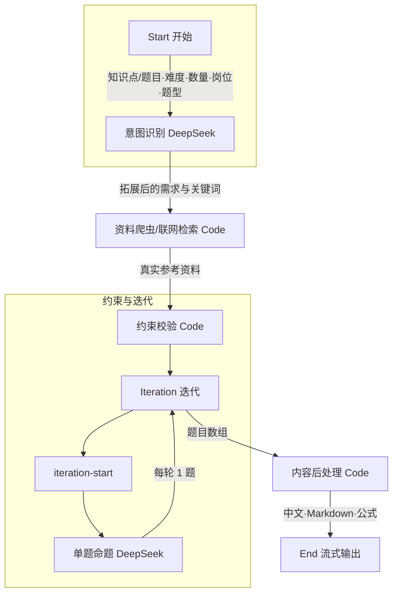

# 智能题库工作流开发计划书 V2

## 一、设计需求（润色版）

### 1.1 开始节点 · 必填参数

| 参数 | 说明 | 选项/格式 |
|------|------|-----------|
| **知识点/题目** | 用户描述的核心考点或出题方向 | 文本输入（支持自然语言） |
| **难度** | 题目难度等级 | 简单 / 中等 / 困难 / 专家 |
| **数量** | 需生成的题目数量 | 数字 |
| **岗位/职业** | 目标考生所属行业或岗位 | 文本输入 |
| **题型** | 题目类型 | 单选题 / 多选题 / 判断题 / 主观题 / 材料题 / 作文 |

---

### 1.2 意图识别模块

新增 **DeepSeek 意图识别节点**，专门用于理解用户的出题需求：

- **输入**：用户自然语言描述（知识点 + 题目方向）
- **输出**：结构化、更具体的出题需求与检索关键词
- **能力**：将模糊表述转化为明确的考点范围与检索指令

---

### 1.3 资料获取模块（联网检索）

- **目标**：基于意图识别结果，**联网查询相关资料**，为命题提供真实、权威的素材支撑
- **要求**：
  - **禁止编造**：资料必须来源于真实网络内容，不得由模型虚构
  - **时效性**：优先获取近期、权威来源的内容
  - **质量**：过滤低质、无关信息

**实现路径**：  
若 Dify 环境无法使用联网搜索插件，则编写 **专业 Python 爬虫脚本**，作为 Code 节点接入工作流，替代联网搜索功能，实现资料抓取与清洗。

---

### 1.4 约束校验模块

对题型、数量、难度等参数进行 **强制性校验**，确保后续命题严格符合用户设定，避免题型错配、数量不符等问题。

---

### 1.5 命题生成模块（迭代出题）

- **模型**：DeepSeek 命题生成节点
- **输入**：上一节点传入的 **资料内容** + **约束条件**
- **结构**：命题模型置于 **迭代节点** 内部
- **规则**：
  - **一次一题**：每次迭代仅生成 1 道题目
  - **篇幅充分**：单题内容完整、解析详实
  - **迭代次数**：由用户在开始节点填写的「数量」参数决定

---

### 1.6 内容后处理模块

通过 **Code 节点** 实现以下逻辑：

1. **语言检测**：检查输出是否为中文；若非中文，则转换为中文
2. **格式规范**：输出内容必须为 **Markdown** 格式
3. **渲染支持**：增加数学公式（LaTeX）及特殊符号的渲染兼容逻辑，确保公式与符号正确展示

---

### 1.7 输出模块

- **模式**：**流式输出**
- **交互风格**：类似 ChatGPT 打字机效果
- **输出节奏**：字速适中，保证阅读体验流畅

---

## 二、工作流拓扑图（预计成品）

```
                                    ┌─────────────────────────────────────┐
                                    │            Start 开始节点             │
                                    │  知识点/题目 · 难度 · 数量 · 岗位 · 题型  │
                                    └─────────────────────┬───────────────┘
                                                          │
                                                          ▼
                                    ┌─────────────────────────────────────┐
                                    │  LLM：意图识别 (DeepSeek)            │
                                    │  理解需求 · 拓展表述 · 生成检索关键词   │
                                    └─────────────────────┬───────────────┘
                                                          │
                                                          ▼
                                    ┌─────────────────────────────────────┐
                                    │  Code：资料爬虫 / 联网检索            │
                                    │  抓取真实资料 · 保障时效与质量         │
                                    └─────────────────────┬───────────────┘
                                                          │
                              ┌───────────────────────────┼───────────────────────────┐
                              ▼                           ▼                           ▼
                    ┌──────────────────┐        ┌──────────────────┐        ┌──────────────────┐
                    │ Code：约束校验   │        │   (传递参数)     │        │   (传递参数)     │
                    │ 题型·数量·难度   │        │                  │        │                  │
                    └────────┬─────────┘        └────────┬─────────┘        └────────┬─────────┘
                             │                           │                           │
                             └───────────────────────────┼───────────────────────────┘
                                                         ▼
                                    ┌─────────────────────────────────────┐
                                    │         Iteration 迭代节点           │
                                    │      迭代次数 = 用户设定数量          │
                                    │  ┌───────────────────────────────┐  │
                                    │  │  iteration-start               │  │
                                    │  └───────────────┬───────────────┘  │
                                    │                  ▼                  │
                                    │  ┌───────────────────────────────┐  │
                                    │  │  LLM：单题命题 (DeepSeek)      │  │
                                    │  │  资料 + 约束 → 1 道完整题目    │  │
                                    │  └───────────────────────────────┘  │
                                    └─────────────────────┬───────────────┘
                                                          │
                                                          ▼
                                    ┌─────────────────────────────────────┐
                                    │  Code：内容后处理                    │
                                    │  中文校验 · Markdown · 公式渲染      │
                                    └─────────────────────┬───────────────┘
                                                          │
                                                          ▼
                                    ┌─────────────────────────────────────┐
                                    │  End：流式输出                       │
                                    │  ChatGPT 样式 · 字速适中             │
                                    └─────────────────────────────────────┘
```

---

## 三、Mermaid 流程图（预计成品）



---

## 四、节点清单与职责

| 序号 | 节点类型 | 节点ID | 职责 |
|------|----------|--------|------|
| 1 | Start | start | 接收：知识点/题目、难度、数量、岗位/职业、题型 |
| 2 | LLM | llm_intent_recognizer | 意图识别，拓展需求，生成检索关键词 |
| 3 | Code | code_crawler | 爬虫抓取/联网检索，获取真实资料 |
| 4 | Code | code_constraint | 题型、数量、难度强制约束 |
| 5 | Iteration | iteration_generator | 按数量迭代，每次输出 1 题 |
| 6 | LLM | llm_question_generator | 单题命题（迭代内） |
| 7 | Code | code_post_process | 中文校验、Markdown、公式渲染 |
| 8 | End | end | 流式输出 |

---

## 五、题型与约束映射

| 题型 | 约束要点 |
|------|----------|
| 单选题 | A/B/C/D 四选一，唯一正解 |
| 多选题 | 多选项，至少两正解 |
| 判断题 | 正确/错误二选一，无选项 |
| 主观题 | 论述型，需评分要点 |
| 材料题 | 给定材料 + 基于材料的若干设问 |
| 作文 | 命题/材料作文，有字数与结构要求 |

---

## 六、流式输出说明

- Dify 工作流在 `response_mode: streaming` 下，可将 LLM 输出以 SSE 流式推送到前端
- 迭代节点采用 **顺序模式**，每完成一题即可流式推送
- 前端需配合 SSE 解析与 Markdown + KaTeX 渲染，实现「打字机 + 公式」的 ChatGPT 式体验

---

## 七、预计交付物

1. **DSL 文件**：`question_factory_v2_full_featured.yml`，可直接导入 Dify
2. **爬虫脚本**：内嵌于「资料爬虫」Code 节点，使用 Wikipedia API 获取中文资料（标准库 `urllib`，无需额外依赖）
3. **约束与后处理脚本**：题型锁（含主观题/材料题/作文）、中文检测、Markdown 与 LaTeX 公式规范化

---

## 八、流式输出配置说明

- 调用 Dify 工作流 API 时，设置 `response_mode: "streaming"`
- 前端需订阅 SSE 事件，按 `text_chunk` 逐字/逐段渲染
- 建议使用 `react-markdown` + `rehype-katex` 实现 Markdown 与数学公式的正确渲染，获得 ChatGPT 式体验
